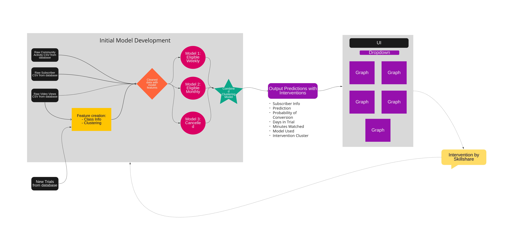

# Skillshare Project
### MADS Capstone Summer 2022

## Contributors
+ Brian Clow
+ Travis Stowe
+ Ryan Estrada
+ Garrett Amstutz

## To get started:
+ Install GNU make
>> make

+ To make sure data files up to date
>> make update_data

## Goals
### Predict subscriptions, specifically who converts from a free trial to an initial subscription
#### Currently utilized surrogates by Skillshare:
+ P1 Net of Refunds (P1NR)
+ 3 videos watched in the first 3 days (3N3)
+ 60 minutes of watch time in 1st 30 days (%60)

## Pipeline

